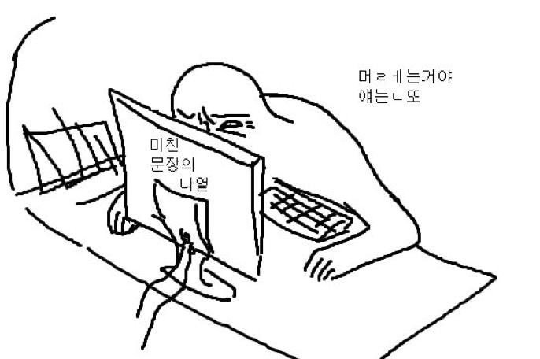
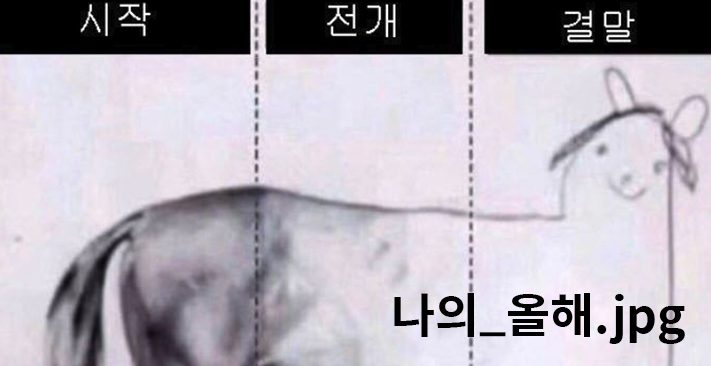

## 블로그 시작!!!

---

2021년 개발을 시작하면서 가장 먼저 해보고 싶었던 것은, 포트폴리오로도 활용할 수 있으면서 개인적인 이야기를 공유할 수 있는 공간을 만드는 것이었다.
구글링을 하다 보면 잘 만들어진 블로그들이 꽤나 많이 보이는데, 그럴 때마다 블로그를 멋지게 꾸미는 능력자분들이 부러웠다. 이렇게 잘 만들어진 블로그를 만드는 것이 나뿐만 아니라 대부분의 주니어 개발자들의 로망이 아닐까 싶다.

그래서 개발을 시작한 초창기에는 공부한 내용을 잊지 않기 위해 글을 몇 개라도 써보자는 취지로 티스토리를 시작했다. 티스토리는 잘 만들어진 템플릿이 많고 관리 페이지도 잘 구성되어 있어서 엄청 편리했고, 약 100개 정도의 글을 작성했던 것 같다.

그러나 티스토리에 글을 업로드하는 것도 점점 뜸해졌고, 개발자로 일하다 보니 업계에서 만난 대부분의 사람들이 본인만의 페이지를 하나씩 가지고 있다는 것을 알게 되었다. 그래서 나도 내 페이지를 만들고자 여러 시도를 해봤지만, 번번이 실패했다.

디자인에 워낙 재능이 없어서 다른 분들이 만든 코드를 가져와서 수정하는 경우가 대부분이었고, 마음에 드는 블로그를 찾지 못한 것도 큰 이유였다. 블로그를 만들다 보면 욕심이 생겨서 이런저런 기능을 추가하고 싶어지는데, 그렇게 진행하다가 지쳐서 포기한 경우가 대부분이었다. ~~작성하다 보니 핑계뿐이다.~~

이번 블로그는 욕심을 부리지 않고, 글만 쓰겠다는 목표로 시작하게 되었다. ~~물론 이번에도 damin님이 만들어주신 템플릿을 가져와서 쓰긴 했다..~~

단순히 config 설정을 바꾸고 아주 간단한 디자인만 변경했을 뿐이지만, 그럼에도 내 서버에 배포하고, 회사 도메인이 아닌 내가 결제한 개인 도메인을 사용했다는 것에 큰 만족감을 느꼈다.

---

&nbsp;&nbsp;&nbsp;

## 두 번째 블로그

---

하루에 블로그 글을 하나씩 작성해보자는 생각으로 티스토리를 시작했지만, 시간이 지나면서 글의 퀄리티가 점점 떨어지기 시작했다. 그러다 보니 자연스럽게 "이게 과연 무슨 의미가 있나?"라는 생각이 들었고, 결국 더 이상 쓰지 않게 되었다.

이번에 새로 시작하는 블로그에서는 조금 더 나은 퀄리티의 글을 쓰는 것을 최우선 목표로 삼고, 이를 위해 꾸준히 노력해볼 생각이다. 단순히 글을 쓰는 것만이 아니라, 글을 통해 내가 전달하고 싶은 메시지를 명확히 표현하고, 나 자신도 성장할 수 있는 공간을 만들고 싶다.

최근 들어 AI에 너무 의존하면서 글을 쓰는 방법이나 사고를 정리하는 과정 자체를 잊어버린 것 같다는 생각이 들었다. 이렇게 글을 쓰는 데 서툴러진 모습을 보며, 내가 스스로의 생각을 정리하고 표현하는 방법을 다시 익혀야겠다는 심각성을 느꼈다. 

앞으로 블로그뿐만 아니라 [Medium](https://medium.com/@0xheun)이나 [X](https://x.com/0xheun) 등 다양한 플랫폼에서도 글을 작성하며, 내 생각을 더 많은 사람들과 공유할 계획이다. 꾸준히 글을 써가며 나만의 관점을 만들어나가고 싶다.

---

&nbsp;&nbsp;&nbsp;

## 중심을 잡아보자

---

요즘 Web3 업계에서 나름대로 성공하신 멋진 분들을 많이 만났다. 그분들의 생각을 듣다 보니 정말 많은 동기부여를 받았다.
특히 본인만의 확고한 생각을 가지고 있고, 그 생각을 가지기까지 얼마나 많은 노력을 해왔는지가 느껴져서 더욱 멋지다고 느껴졌다.

최근 "중심을 잡아라"라는 문장에 꽂힌 것 같다.
어떤 일을 하든 묵묵히, 꾸준히 열심히 하는 것이 굉장히 중요하며, 그렇게 노력하는 사람들에게는 결국 기회가 온다고 믿는다.
특히 Web3 업계는 워낙 빠르게 메타가 변하는 곳이다 보니, 갈팡질팡하지 않고 중심을 잡는 것이 더더욱 중요하다고 느꼈다.

또한 성공하신 분들 중에는 자신의 생각을 글로 정리하는 경우가 많다.
그런 모습을 보며 나 역시 이를 본받아야겠다는 생각이 들었고, 이것이 블로그를 다시 시작하려는 결심을 하게 된 이유 중 하나가 되었다.

---

&nbsp;&nbsp;&nbsp;

## 앞으로의 목표?

---

앞으로 블로그 글을 통해 Web3 개발자로서의 경험, 그리고 코어 개발이나 노드 관련 인프라 개발 등 내가 다루고 관심있는 다양한 기술적 주제를 정리하려고 한다.

작성된 글들을 살펴보면서 개발자로서 내가 어디에 서 있는지, 어디로 가야 할지를 더 분명히 알 수 있을 것 같다. 
그리고 내가 이해한 방식대로 복잡한 기술 개념들을 풀어내면, 나처럼 비슷한 주제를 공부하는 사람들에게도 작은 도움이 될 수도 있지 않을까 하는 기대도 있다.

이 과정을 통해 더 단단한 개발자로 성장할 수 있기를 염원하면서.. 꾸준히 해봐야겠다 :)

---
